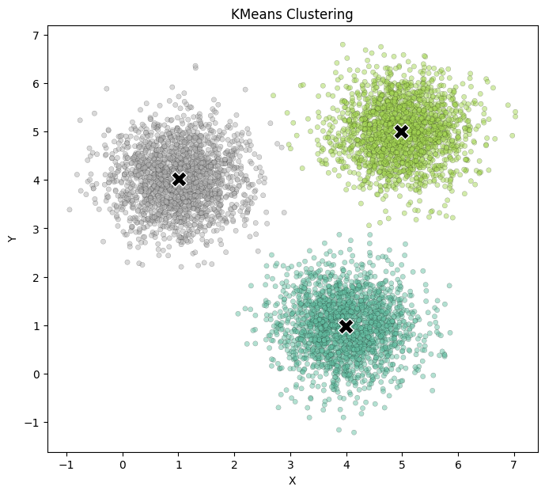

# 🧠 Python K-Means Clustering from Scratch

## 📚 Table of Contents

- [Project Overview](#-project-overview)
- [Highlights](#-highlights)
- [Sample Output / Visualization](#-sample-output--visualization)
- [Tools and Technologies](#-tools-and-technologies)
- [How to Run](#-how-to-run)
- [Educational Context](#-educational-context)
- [Constraints & Rules](#-constraints--rules)
- [Author](#-author)
- [License](#-license)
- [Related](#-related)

---

## 📘 Project Overview

This project was developed as part of a university midterm challenge and is focused on mastering **core Python programming concepts** and implementing a **K-Means clustering algorithm** from scratch, without relying on third-party libraries like NumPy or scikit-learn.

The assignment is split into two major parts:
- **Python Fundamentals**: Exercises covering variables, data structures, loops, functions, and basic algorithms.
- **Unsupervised Machine Learning**: A complete K-Means clustering implementation using only the Python Standard Library.

> 🚫 **No external libraries (e.g., NumPy, pandas, scikit-learn)** were used—everything is written using pure Python.

---

## ✨ Highlights

- Wrote reusable functions for:
  - Calculating Euclidean distance
  - Initializing random centroids
  - Assigning clusters
  - Updating centroids iteratively
- Implemented a full K-Means clustering loop until convergence
- Solved foundational Python problems using loops, conditionals, and lists

---

## 📊 Sample Output / Visualization

---

## 🛠️ Tools and Technologies

- Python 3.x
- Google Colab Notebook
- Python Standard Library modules only:
  - `random`
  - `math`
  - `copy`
  - `sys`

---

## 🔍 How to Run

You can run the notebook in **Google Colab** or any local Jupyter environment:

1. Upload `python_challenge.ipynb` to [Google Colab](https://colab.research.google.com/)
2. Click `Runtime` > `Run all`
3. Ensure no cell raises an error before using or sharing

---

## 🎓 Educational Context

This project was created as a midterm assignment for the course:

> **Course Name**: *Programming For Data Science*  
> **Instructor**: *Flávio L. Pinheiro*  
> **Institution**: *NOVA Information Management School (NOVA IMS), Universidade Nova de Lisboa *  
> **Semester**: *Spring 2025*

---

## ⚠️ Constraints & Rules

- ❗ **Only Standard Library modules allowed**
- ✅ Final submission must run **error-free**
- 💡 Minimal and modular testing encouraged
- 🔒 Academic integrity policy enforced

---

## 🙋 Author

- **Name**: *AbdulQudus Adebogun*
- **Student ID**: *20241355*
- **Email**: *abdul.adebogun@gmail.com*

---

## 📌 License

This is an academic project and is shared publicly for educational and portfolio purposes only. Please do not plagiarize or reuse code without proper attribution.

---

## 📎 Related

- [K-Means Algorithm - Wikipedia](https://en.wikipedia.org/wiki/K-means_clustering)
- [Google Colab](https://colab.research.google.com/)
- [Python Docs](https://docs.python.org/3/library/)

